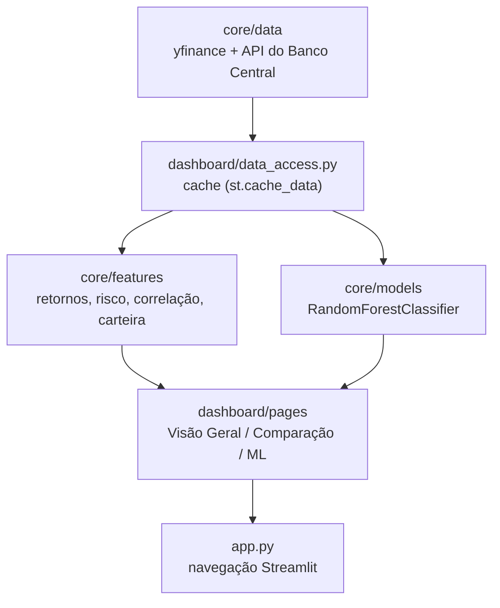
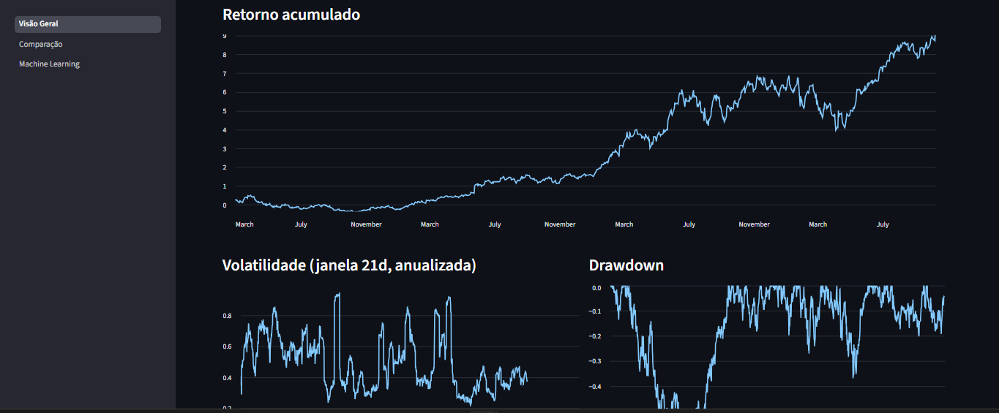
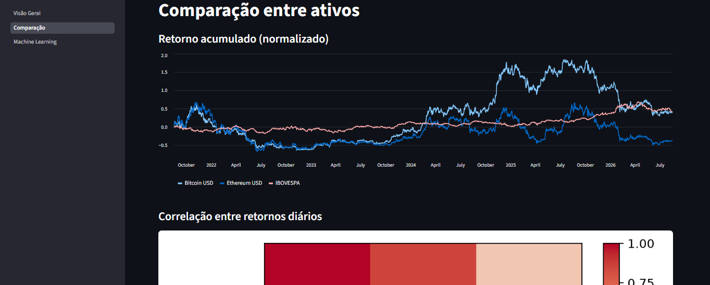
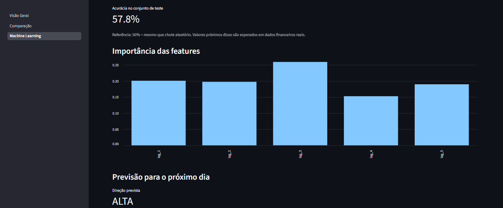

# Market Intelligence Dashboard

🔗 **[Acesse o app aqui] (Pode demorar um pouco no primeiro carregamento) 
(https://market-intelligence-dashboard-7nvfhcavxiywfpcj2gkxrt.streamlit.app/)**

Dashboard em Python para análise quantitativa de ativos financeiros (ações, criptomoedas e índices), com busca de ativos em tempo real, comparação de carteiras e um módulo de Machine Learning para classificação da direção do retorno diário.

Projeto de portfólio construído para demonstrar organização de código, análise de dados financeiros e um pipeline de ML simples. Não é uma ferramenta de trading nem um sistema de previsão de mercado.

---

## Visão Geral

A aplicação é dividida em três telas Streamlit. O usuário busca um ativo por nome ou ticker (via Yahoo Finance), e a partir daí pode:

- analisar um ativo individualmente (preço, retorno, volatilidade, drawdown, Sharpe Ratio);
- montar uma carteira com múltiplos ativos, comparando retornos, correlação e métricas consolidadas da carteira;
- treinar, sob demanda, um classificador que estima a probabilidade de alta do ativo no próximo pregão.

Toda a lógica de cálculo (aquisição de dados, métricas financeiras e ML) fica em `core/`, sem nenhuma dependência de Streamlit. A camada `dashboard/` apenas consome essas funções e cuida da apresentação e do cache.

---

## Features

**Visão Geral (ativo individual)**
- Busca de ativos por nome/ticker
- Histórico de preços (tabela + gráfico)
- Retorno diário e retorno acumulado
- Volatilidade móvel anualizada (janela de 21 dias)
- Drawdown
- Sharpe Ratio anualizado, usando a taxa Selic atual como taxa livre de risco

**Comparação / Carteira (múltiplos ativos)**
- Seleção de vários ativos, com conversão automática de moeda para BRL quando o ativo é cotado em outra moeda
- Retorno acumulado comparado entre os ativos
- Matriz de correlação entre retornos diários (heatmap)
- Definição de pesos da carteira (com validação de que somam 100%)
- Retorno, volatilidade (via matriz de covariância) e Sharpe Ratio da carteira
- Evolução histórica e drawdown da carteira

**Machine Learning**
- Classificação binária da direção do retorno do próximo dia (alta/baixa) para um ativo
- Acurácia no conjunto de teste
- Importância das features utilizadas pelo modelo
- Previsão para o próximo dia, com probabilidade associada

---

## Análise Financeira

**Retorno diário e acumulado**
Retorno percentual entre pregões consecutivos, composto ao longo do tempo para obter o retorno acumulado do período.

**Volatilidade**
Desvio padrão dos retornos diários anualizado (`√252`), usado como medida de risco. Calculada tanto de forma móvel (janela de 21 dias) quanto para o período completo.

**Drawdown**
Queda percentual do preço em relação ao pico histórico mais recente — sempre menor ou igual a zero.

**Sharpe Ratio**
Retorno médio excedente (acima da taxa livre de risco) dividido pela volatilidade dos retornos, anualizado. A taxa livre de risco usada é a Selic atual, obtida via API pública do Banco Central.

**Correlação**
Matriz de correlação de Pearson entre os retornos diários dos ativos selecionados, usada para embasar a diversificação da carteira.

**Carteira**
O retorno da carteira é a soma ponderada dos retornos dos ativos. A volatilidade da carteira **não** é a média ponderada das volatilidades individuais — é calculada via matriz de covariância (`wᵀ·Σ·w`), levando em conta a correlação entre os ativos.

---

## Machine Learning

O módulo de ML treina um `RandomForestClassifier` (scikit-learn) para prever se o retorno do **próximo dia** será positivo (1) ou negativo/nulo (0) para o ativo selecionado.

- **Features:** os últimos 5 retornos diários (`lag_1` a `lag_5`)
- **Target:** binário — 1 se o retorno do dia seguinte for positivo, 0 caso contrário
- **Divisão treino/teste:** `train_test_split` com `shuffle=False` (mantém a ordem cronológica, evitando vazamento de informação futura)
- **Modelo:** `RandomForestClassifier(n_estimators=400, max_depth=4)`
- **Avaliação:** acurácia no conjunto de teste, exibida junto com a referência de que 50% equivale a um chute aleatório
- **Requisito mínimo:** o treino só é executado se houver pelo menos 50 amostras após a construção das features

O próprio dashboard já deixa isso explícito na interface: em dados financeiros reais, é esperado que a acurácia fique próxima de 50%. O modelo serve para demonstrar um pipeline de ML (features, treino, avaliação, inferência) e **não** deve ser interpretado como um sistema confiável de previsão de mercado — não há validação walk-forward, tuning de hiperparâmetros ou backtesting.

---

## Arquitetura



- `core/` contém toda a lógica de negócio (aquisição de dados, cálculos financeiros e ML) como funções puras, sem nenhuma referência a Streamlit — o que também é o que permite testá-las isoladamente.
- `dashboard/data_access.py` é a única ponte entre `core/` e a interface: encapsula as chamadas de `core/` com `st.cache_data`, evitando requisições repetidas às APIs externas.
- `dashboard/pages/` contém exclusivamente lógica de apresentação (Streamlit), consumindo os dados já processados.
- `app.py` apenas registra as páginas e delega a navegação ao Streamlit (`st.navigation`).

---

## Tech Stack

**Language**
- Python

**Application**
- Streamlit

**Data Analysis**
- Pandas
- NumPy

**Visualization**
- Matplotlib (heatmap de correlação) + gráficos nativos do Streamlit

**Machine Learning**
- Scikit-learn (`RandomForestClassifier`)

**Data Source**
- yfinance (preços históricos, câmbio e busca de ativos)
- API pública do Banco Central do Brasil (taxa Selic)

**Testes**
- Pytest (funções puras de `core/features` e `core/models`)

---

## Estrutura do Projeto

```text
market-intelligence-dashboard/
├── app.py                      # Ponto de entrada — registra as páginas e a navegação
├── core/                       # Lógica de negócio, sem dependência de Streamlit
│   ├── data/
│   │   ├── loader.py           # Preços históricos e moeda do ativo (yfinance)
│   │   ├── fx.py                # Taxa de câmbio entre duas moedas
│   │   ├── search.py            # Busca de ativos por nome/ticker
│   │   └── selic.py             # Taxa Selic atual (API do Banco Central)
│   ├── features/
│   │   ├── returns.py           # Retorno diário e acumulado
│   │   ├── risk.py              # Volatilidade, drawdown, Sharpe Ratio
│   │   ├── correlation.py       # Matriz de correlação
│   │   ├── currency.py          # Conversão de série de preços entre moedas
│   │   ├── portfolio.py         # Retorno e volatilidade da carteira
│   │   └── ml.py                # Construção de features (lags) e target para ML
│   └── models/
│       └── predictor.py         # Treino do RandomForestClassifier
├── dashboard/
│   ├── data_access.py           # Camada de cache entre core/ e as páginas
│   └── pages/
│       ├── home.py              # Página "Visão Geral" (ativo individual)
│       ├── comparison.py        # Página "Comparação" (múltiplos ativos + carteira)
│       └── ml.py                # Página "Machine Learning"
├── tests/                       # Testes unitários (apenas core/features e core/models)
├── requirements.txt
└── requirements-dev.txt
```

---

## Como rodar localmente (opcional):

```bash
git clone <repo-url>
cd market-intelligence-dashboard

python -m venv venv
.venv\Scripts\activate       # Linux/macOS:  source venv/bin/activate     

pip install -r requirements.txt
streamlit run app.py
```

Para rodar os testes:

```bash
pip install -r requirements-dev.txt
pytest
```

---

## Uso

1. Na página **Visão Geral**, digite o nome ou ticker de um ativo (ex: "Petrobras", "Apple", "Bitcoin"), escolha um dos resultados e confirme para ver preço, retornos, volatilidade, drawdown e Sharpe Ratio.
2. Na página **Comparação**, adicione dois ou mais ativos à carteira, ajuste o peso (%) de cada um até somarem 100% e visualize o retorno acumulado, a correlação entre os ativos e as métricas consolidadas da carteira.
3. Na página **Machine Learning**, escolha um ativo e confirme para treinar o classificador e ver a acurácia, a importância das features e a previsão de direção para o próximo dia.

---

## Screenshots






---

## Limitações

- Dependência total do Yahoo Finance para preços, câmbio e busca de ativos — sem fonte alternativa em caso de indisponibilidade.
- A conversão de moeda usa a taxa de câmbio de fechamento como proxy, sem considerar spread ou custos reais de conversão.
- O modelo de ML usa uma única divisão treino/teste fixa, sem validação cruzada, walk-forward ou tuning de hiperparâmetros — tem fins demonstrativos, não preditivos.
- Não há testes automatizados para a camada Streamlit (`dashboard/`), apenas para as funções puras de `core/`.
- A taxa Selic depende da disponibilidade da API do Banco Central, sem fallback caso ela esteja fora do ar.

---

##  Futuras melhoras

**Short-term**
- Tratamento de erro mais robusto para falhas de rede nas chamadas ao yfinance e à API do Banco Central
- Adicionar novas métricas de risco, como Value at Risk (VaR)

**Long-term**
- Validação walk-forward e backtesting mais rigoroso para o modelo de ML
- Persistência de dados em banco de dados, em vez de apenas cache em memória por sessão
- Deploy público da aplicação (ex: Streamlit Community Cloud)

---

## Disclaimer

Este projeto tem finalidade educacional e de portfólio. As análises e métricas apresentadas **não constituem recomendação de investimento**. Resultados históricos não garantem resultados futuros, e o módulo de Machine Learning **não deve ser interpretado como um sistema confiável de previsão de mercado**.

---

## Autor

**Caio Cordeiro Matos**
[GitHub](https://github.com/seu-usuario) · [LinkedIn](https://linkedin.com/in/seu-usuario)
